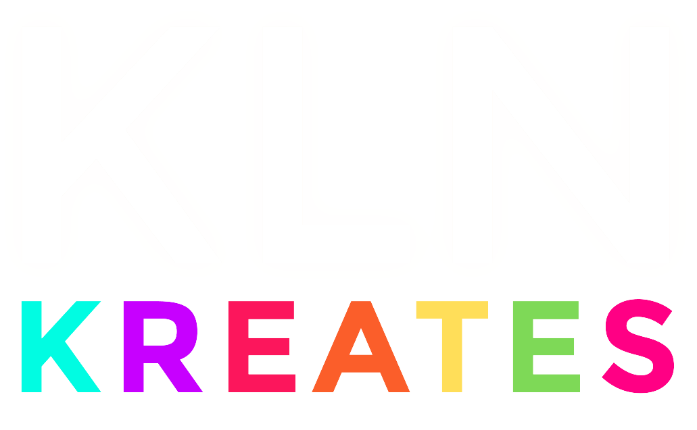

<a name="readme-top">

<br/>

<br />
<div align="center">
  <a href="https://github.com/zyx-0314/">
  <!-- TODO: If you want to add logo or banner you can add it here -->
    
  </a>
<!-- TODO: Change Title to the name of the title of your Project -->
  <h3 align="center">Seatwork 1</h3>
</div>
<!-- TODO: Make a short description -->
<div align="center">
 This is an individual project that is a focused on systems that uses HTML and Javascript. The problem set that was assigned to me is problem set number 2, which is the Car Rental System.
</div>

<br />

<!-- TODO: Change the zyx-0314 into your github username  -->
<!-- TODO: Change the WD-Template-Project into the same name of your folder -->


---

<br />
<br />

<!-- TODO: If you want to add more layers for your readme -->
<details>
  <summary>Table of Contents</summary>
  <ol>
    <li>
      <a href="#overview">Overview</a>
      <ol>
        <li>
          <a href="#key-components">Key Components</a>
        </li>
        <li>
          <a href="#technology">Technology</a>
        </li>
      </ol>
    </li>
    <li>
      <a href="#rule,-practices-and-principles">Rules, Practices and Principles</a>
    </li>
    <li>
      <a href="#resources">Resources</a>
    </li>
  </ol>
</details>

---

## Overview

<!-- TODO: To be changed -->
<!-- The following are just sample -->
The Website I have created is a Car Rental System, it basically gets users to rent a car online. The key components are Multipage website, Transactional, and Parallax transition. I used HTML for the code structure, Javascript for the functionalities, and CSS for the design itself. On the homepage, we have a hero page with a rent a car button below to get the users started with the car rental. below this section is the steps to take for renting a car. and below this section ia 3 featured cars with buttons to view thje car details and a view all cars button below to see the rest of the available offered cars. On the Book Cars page is where the user will input rentail details such as the date and time for pick-up and drop-off, we also has the filter panel on the left side for the users to better find their dessired cars. and on the right is the rest of the cars where they can check to see if the car is available for rent or not. When the car is available, it is eligible for payment. The user can now pick if they will pay full online or give a 50% down payment and pay cash in person to assure the admin that the user will proceed on getting the car. Once payment is settled, a receipt will pop up on their screen and now the user has already rented a car and is available for pick-up on their desired date and time.

Guiding Question:
- What is the project
- Whats the purpose
- What are key components
- What technology used and how it is used

### Key Components
<!-- TODO: List of Key Components -->
<!-- The following are just sample -->
- MultiPage Website/Single Page Website
- Parallax transition
- Transactional

### Technology
<!-- TODO: List of Technology Used -->


## Rules, Practices and Principles
1. Always use `WD-` in the front of the Title of the Project for the Subject followed by your custom naming.
2. Do not rename any .html files; always use `index.html` as the filename.
3. Place Files in their respective folders.
4. All file naming are in camel case.
   - Camel case is naming format where there is no white space in separation of each words, the first word is in all lower case while the succeding words first letter are in upper followed by lower cased letters.
   - ex.: buttonAnimatedStyle.css
5. Use only `External CSS`.
6. Renaming of Pages folder names are a must, and relates to what it is doing or data it holding.
7. File Structure to follow below.

```
WD-ProjectName
└─ assets
|   └─ css
|   |   └─ style.css
|   └─ img
|   |   └─ fileWith.jpeg/.jpg/.webp/.png
|   └─ js
|       └─ script.js
└─ pages
|  └─ pageName
|     └─ assets
|     |  └─ css
|     |  |  └─ style.css
|     |  └─ img
|     |  |  └─ fileWith.jpeg/.jpg/.webp/.png
|     |  └─ js
|     |     └─ script.js
|     └─ index.html
└─ index.html
└─ readme.md
```

## Resources

<!-- TODO: Add References -->
| Title | Purpose | Link |
|-|-|-|
| Chatgpt | For guide in revising the html code | https://chatgpt.com/ |
| Youtube | For guide in javascript and css  | https://www.youtube.com/ |
| Canva | For guide images and elements | https://www.canva.com/ |
| W3schools | For css and html guide | https://www.w3schools.com/ |
| Stack Overflow | For guide in revising the code | https://stackoverflow.com/ |